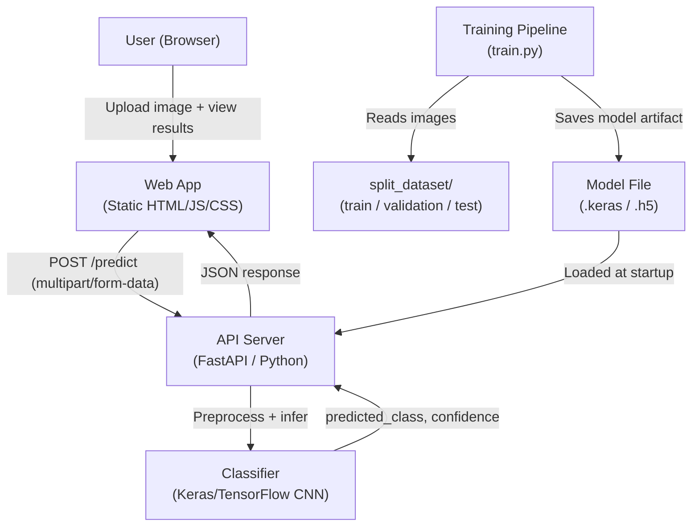

# Technical Design Document

## Fish Disease Detection Web Application

---

## Overview

The Fish Disease Detection system is a full-stack web application that enables fish farmers, aquaculture workers, and veterinarians to upload a photograph of a fish and receive an automated disease classification in near real-time. The system classifies images into one of four categories: **Healthy**, **EUS (Epizootic Ulcerative Syndrome)**, **Bacterial Gill Disease**, or **Bacterial Red Spot Disease**.

The system is composed of three main parts:

1. **Training Pipeline** — a Python script that trains a CNN-based image classifier on the labeled dataset and saves the model artifact.
2. **API Server** — a lightweight Python HTTP server (FastAPI) that loads the trained model and exposes a `/predict` endpoint.
3. **Web App** — a static HTML/CSS/JavaScript frontend that provides the upload interface, displays results, and communicates with the API Server.

The application is designed to run locally with minimal setup, making it suitable for demonstration and field testing.

---

## Architecture



### Technology Choices

| Component | Technology | Rationale |
|---|---|---|
| Training Pipeline | Python, TensorFlow/Keras | Industry-standard for CNN training; MobileNetV2 transfer learning suits small datasets |
| API Server | FastAPI (Python) | Async-capable, automatic OpenAPI docs, easy multipart file handling |
| Web App | Vanilla HTML/CSS/JavaScript | No build toolchain required; runs as a static file; maximally portable |
| Model Format | Keras `.keras` (or `.h5`) | Native Keras format; loadable with a single `keras.models.load_model()` call |

---

## Components and Interfaces

### 1. Training Pipeline (`train.py`)

Responsible for loading data, training the model, evaluating it, and saving the artifact.

**Key responsibilities:**
- Load images from `split_dataset/train` and `split_dataset/validation` using `ImageDataGenerator` (or `tf.data`)
- Apply data augmentation to training images
- Build a transfer-learning model (MobileNetV2 base + custom classification head)
- Train the model and print training/validation accuracy per epoch
- Evaluate on `split_dataset/test` and print per-class precision, recall, F1-score
- Save the trained model to a configurable output path (default: `model/fish_disease_model.keras`)

**Interface (CLI):**
```
python train.py [--output model/fish_disease_model.keras] [--epochs 20] [--batch-size 32]
```

**Outputs to console:**
- Per-epoch training accuracy and validation accuracy
- Final test set: overall accuracy, per-class precision, recall, F1-score (via `sklearn.metrics.classification_report`)

---

### 2. API Server (`app.py`)

A FastAPI application that serves the `/predict` endpoint.

**Startup behavior:**
- Reads model path from environment variable `MODEL_PATH` (default: `model/fish_disease_model.keras`)
- Loads the Keras model; if the file is not found, logs an error and exits with code 1
- Starts the HTTP server (default port 8000)

**Endpoints:**

#### `POST /predict`

| Field | Detail |
|---|---|
| Content-Type | `multipart/form-data` |
| Request field | `file` — image file (JPEG, JPG, PNG) |
| Success response | HTTP 200, JSON: `{"predicted_class": string, "confidence": float}` |
| No file | HTTP 400, JSON: `{"error": "No image file provided"}` |
| Unsupported format | HTTP 422, JSON: `{"error": "Unsupported file format. Accepted: JPEG, JPG, PNG"}` |
| Internal error | HTTP 500, JSON: `{"error": "Internal server error: <detail>"}` |

**Image preprocessing (applied before inference):**
1. Decode image bytes → PIL Image
2. Convert to RGB (handles RGBA/grayscale edge cases)
3. Resize to 224×224 pixels (MobileNetV2 input size)
4. Normalize pixel values to [0, 1] (divide by 255)
5. Add batch dimension → shape `(1, 224, 224, 3)`

**Class label mapping:**
```python
CLASS_LABELS = {
    0: "eus",
    1: "gill",
    2: "healthy",
    3: "red_spot"
}
```
(Alphabetical order matches Keras `flow_from_directory` default.)

**CORS:** The API Server SHALL enable CORS for all origins to allow the static frontend to communicate with it during local development.

---

### 3. Web App (`index.html`, `style.css`, `app.js`)

A single-page static application.

**User flow:**
1. User opens `index.html` in a browser
2. User selects an image file via file input or drag-and-drop
3. App validates file type and size client-side; shows preview
4. User clicks "Analyze" button
5. App shows loading spinner; sends `POST /predict` to API Server
6. App displays result: disease label, confidence percentage, disease description, treatment recommendations (if applicable), and the uploaded image

**Key UI states:**
- **Idle**: Upload area visible, no result shown
- **Preview**: Image selected, preview shown, "Analyze" button enabled
- **Loading**: Spinner shown, button disabled
- **Result**: Prediction card shown with all result fields
- **Error**: Error message shown with retry option

**Disease display content (hardcoded in `app.js`):**

| Class | Human-readable label | Description | Treatment |
|---|---|---|---|
| `healthy` | Healthy | Fish appears healthy with no signs of disease | — |
| `eus` | EUS (Epizootic Ulcerative Syndrome) | Fungal/bacterial disease causing ulcerative lesions | Improve water quality, reduce stocking density, apply antifungal treatments (e.g., potassium permanganate bath), consult a veterinarian for antibiotic therapy if secondary bacterial infection is present |
| `gill` | Bacterial Gill Disease | Bacterial infection affecting gill tissue | Improve water quality and aeration, reduce organic load, apply salt baths or potassium permanganate treatments, administer antibiotics as prescribed by a veterinarian |
| `red_spot` | Bacterial Red Spot Disease | Bacterial infection causing red hemorrhagic spots on skin | Isolate affected fish, improve water quality, apply antibiotic baths (e.g., oxytetracycline), consult a veterinarian for systemic antibiotic treatment if infection is severe |

**API base URL:** Configurable via a `const API_BASE_URL` constant at the top of `app.js` (default: `http://localhost:8000`).

---

## Data Models

### Dataset Structure

```
split_dataset/
├── train/
│   ├── eus/          (388 images)
│   ├── gill/         (650 images)
│   ├── healthy/      (676 images)
│   └── red_spot/     (616 images)
│                     Total: 2,330 images
├── validation/
│   ├── eus/          (120 images)
│   ├── gill/         (298 images)
│   ├── healthy/      (322 images)
│   └── red_spot/     (193 images)
│                     Total: 933 images
└── test/
    ├── eus/          (120 images)
    ├── gill/         (316 images)
    ├── healthy/      (330 images)
    └── red_spot/     (196 images)
                      Total: 962 images
```

**Note:** The EUS class is significantly smaller (~388 train images vs ~650–676 for other classes). The training pipeline should account for this class imbalance using class weights.

### ML Model Architecture

**Base model:** MobileNetV2 (pretrained on ImageNet, `include_top=False`)
- Input shape: `(224, 224, 3)`
- Base layers frozen during initial training

**Classification head:**
```
GlobalAveragePooling2D
Dense(128, activation='relu')
Dropout(0.3)
Dense(4, activation='softmax')
```

**Training configuration:**
- Optimizer: Adam (lr=1e-4)
- Loss: categorical crossentropy
- Metrics: accuracy
- Class weights: computed from training set distribution to handle EUS imbalance
- Early stopping: patience=5 on validation accuracy

### API Request/Response Schemas

**Request (multipart/form-data):**
```
file: <binary image data>
```

**Success Response (HTTP 200):**
```json
{
  "predicted_class": "gill",
  "confidence": 0.923
}
```

**Error Response:**
```json
{
  "error": "<human-readable error message>"
}
```

### Confidence Score Display

The Web App converts the raw `confidence` float to a display percentage:
```
display = round(confidence * 100, 1)  →  "92.3%"
```

---

## Correctness Properties

*A property is a characteristic or behavior that should hold true across all valid executions of a system — essentially, a formal statement about what the system should do. Properties serve as the bridge between human-readable specifications and machine-verifiable correctness guarantees.*

### Property 1: Confidence score is a valid probability

*For any* valid image submitted to the `/predict` endpoint, the returned `confidence` value SHALL be a float in the closed interval [0.0, 1.0].

**Validates: Requirements 6.2**

---

### Property 2: Predicted class is always a known Disease_Class

*For any* valid image submitted to the `/predict` endpoint, the returned `predicted_class` SHALL be exactly one of: `"healthy"`, `"eus"`, `"gill"`, `"red_spot"`.

**Validates: Requirements 2.1, 6.2**

---

### Property 3: Confidence display round-trip

*For any* confidence float `c` in [0.0, 1.0], converting to a display percentage and back SHALL preserve the value to within one decimal place of precision (i.e., `round(c * 100, 1) / 100` is within 0.001 of `c`).

**Validates: Requirements 3.2**

---

### Property 4: File format validation rejects non-supported types

*For any* file whose extension is not in `{jpg, jpeg, png}` (case-insensitive), the API Server SHALL return HTTP 422 and the Web App SHALL reject the file client-side without sending a request.

**Validates: Requirements 1.3, 6.4**

---

### Property 5: File size validation rejects oversized files

*For any* file larger than 10 MB, the Web App SHALL reject the file client-side and display an error message, without sending a request to the API Server.

**Validates: Requirements 1.4**

---

### Property 6: Image preprocessing preserves shape invariant

*For any* valid input image of any size and mode (RGB, RGBA, grayscale), the preprocessing pipeline SHALL produce a tensor of shape `(1, 224, 224, 3)` with all pixel values in [0.0, 1.0].

**Validates: Requirements 2.1**

---

### Property 7: Disease content completeness

*For any* non-healthy predicted class (`eus`, `gill`, `red_spot`), the Web App SHALL display a non-empty disease description AND a non-empty treatment recommendation string.

**Validates: Requirements 3.3, 3.5, 3.6, 3.7**

---

## Error Handling

### API Server

| Scenario | HTTP Status | Response |
|---|---|---|
| No file in request | 400 | `{"error": "No image file provided"}` |
| Unsupported file format | 422 | `{"error": "Unsupported file format. Accepted: JPEG, JPG, PNG"}` |
| Model inference error | 500 | `{"error": "Internal server error: <detail>"}` |
| Model file not found at startup | — | Log error, `sys.exit(1)` |

### Web App (Client-side)

| Scenario | Behavior |
|---|---|
| File type not supported | Show inline error, do not send request |
| File size > 10 MB | Show inline error, do not send request |
| Network error / fetch failure | Show error banner with "Retry" button |
| API returns 4xx/5xx | Show error message from response body |
| API returns unexpected JSON shape | Show generic error message |

### Training Pipeline

| Scenario | Behavior |
|---|---|
| Dataset directory not found | Print error message, exit with non-zero code |
| Insufficient images per class | Print warning, continue training |
| Output directory does not exist | Create it automatically before saving |

---

## Testing Strategy

### Unit Tests

Unit tests cover pure logic functions that do not require a running server or model.

**API Server unit tests (`tests/test_api.py`):**
- `validate_file_format(filename)` — test accepted and rejected extensions
- `preprocess_image(bytes)` — test output shape `(1, 224, 224, 3)` and value range [0, 1] for various input sizes and modes
- `format_confidence(float)` — test rounding to one decimal place

**Web App unit tests (`tests/test_app.js` — using Jest or Vitest):**
- `validateFileType(file)` — test accepted/rejected MIME types and extensions
- `validateFileSize(file)` — test files at, below, and above 10 MB boundary
- `formatConfidence(float)` — test display string generation
- `getDiseaseContent(class)` — test that all four classes return the correct label, description, and treatment fields

### Property-Based Tests

Property-based tests use **Hypothesis** (Python) for the API/preprocessing layer and **fast-check** (JavaScript) for the Web App logic layer. Each test runs a minimum of **100 iterations**.

**Python property tests (`tests/test_properties.py`):**

```
# Feature: fish-disease-detection, Property 1: confidence is a valid probability
# Feature: fish-disease-detection, Property 2: predicted class is a known Disease_Class
# Feature: fish-disease-detection, Property 3: confidence display round-trip
# Feature: fish-disease-detection, Property 4: file format validation rejects non-supported types
# Feature: fish-disease-detection, Property 5: file size validation rejects oversized files
# Feature: fish-disease-detection, Property 6: image preprocessing preserves shape invariant
# Feature: fish-disease-detection, Property 7: disease content completeness
```

- **Property 1 & 2**: Generate random valid images (using Hypothesis `st.binary()` shaped as valid JPEG/PNG), run through the preprocessing + mock model inference, assert confidence ∈ [0.0, 1.0] and class ∈ known set.
- **Property 3**: Generate random floats in [0.0, 1.0], assert round-trip display conversion.
- **Property 4**: Generate random filenames with random extensions, assert validation function returns correct accept/reject.
- **Property 6**: Generate random image dimensions and modes, assert preprocessing output shape and value range.

**JavaScript property tests (`tests/app.property.test.js`):**

- **Property 5**: Generate random file sizes, assert `validateFileSize` rejects files > 10 MB.
- **Property 7**: For each non-healthy class, assert `getDiseaseContent` returns non-empty description and treatment.

### Integration Tests

Integration tests require the API Server to be running with a real (or stub) model.

- `POST /predict` with a valid JPEG → assert HTTP 200, valid JSON shape, class in known set, confidence in [0, 1]
- `POST /predict` with no file → assert HTTP 400
- `POST /predict` with a `.txt` file → assert HTTP 422
- API Server startup with missing model file → assert process exits with non-zero code

### Model Evaluation

The training pipeline outputs a `classification_report` (sklearn) covering:
- Overall accuracy (target: ≥ 80%)
- Per-class precision, recall, F1-score (target: F1 ≥ 0.75 per class)

These are verified by inspecting console output after running `train.py`.

 